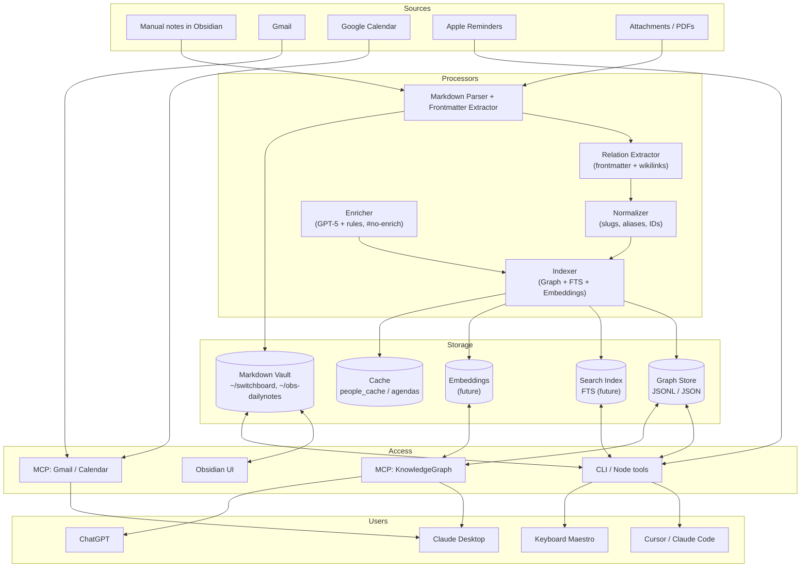

# Obsidian Daily Notes & GTD System

A Node.js toolkit that integrates Google Calendar events, Apple Reminders, and Getting Things Done (GTD) methodology to create an organized daily workflow in Obsidian.

## ⚠️ Active Development Notice

This codebase is under active development with frequent refactoring and restructuring. If you're interested in contributing, please open an issue or reach out first so we can coordinate efforts and avoid conflicts.

## What This Does

This toolkit automatically:

- Pulls your Google Calendar events into daily markdown notes
- Syncs Apple Reminders as GTD-organized tasks
- Links meeting attendees to person pages with contact information
- Generates agenda items for each person you're meeting (optional; disabled by default via `ENABLE_AGENDAS=false`)
- Creates task dashboards organized by project and status

All data is stored as plain Markdown files in your Obsidian vault, giving you full control over your information.

> Quickstart and common commands: see [docs/USAGE.md](docs/USAGE.md) for a concise usage guide and suggested Keyboard Maestro triggers.

## About Obsidian

[Obsidian](https://obsidian.md) is a note-taking application that works with local Markdown files. It features bidirectional linking, graph visualization, and extensive customization through plugins. Your data stays on your computer as plain text files.

To get started:

1. Download Obsidian from [obsidian.md](https://obsidian.md)
2. Create a vault (a folder on your computer)
3. Configure this toolkit to point to your vaul

## Why Markdown

Markdown is a plain text format that:

- Works in any text editor
- Tracks well in Gi
- Will be readable decades from now
- Converts easily to HTML, PDF, or other formats

Example:

```markdown
# Meeting Notes

- [[John Smith]], [[Sarah Chen]]
- [ ] Send proposal #email
- [ ] Review budget #task
```tex

## Architecture

This codebase uses JavaScript for API integrations and Python for file operations. Scripts run on-demand or via automation to keep your notes synchronized with external services while maintaining all data locally in an open format.

### Knowledge Graph Overview

The personal knowledge graph spans `~/switchboard` and `~/obs-dailynotes` using a JSON graph store (no SQLite). See the roadmap for details. High-level diagram:



See [docs/INTEGRATION_ARCHITECTURE.md](docs/INTEGRATION_ARCHITECTURE.md) for detailed system design, [docs/GTD_SYSTEM_DESIGN.md](docs/GTD_SYSTEM_DESIGN.md) for the complete GTD implementation guide, and [docs/Knowledge Graph MCP.md](docs/Knowledge%20Graph%20MCP.md) for MCP usage (tagged `documentation`).

## Roadmap

See [docs/ROADMAP.md](docs/ROADMAP.md) for planned features, improvements, and sync strategy including private folders and team collaboration.

## Core Features

### Daily Notes Generation

- Fetches and formats Google Calendar events into daily notes
- Parses meeting details (Google Meet, Zoom links, locations)
- Creates markdown-formatted notes with navigation links
- Automatically links attendees to person pages
- Injects per-person agenda items from Apple Reminders (optional; disabled by default via `ENABLE_AGENDAS=false`)

### GTD Processing System

- Full GTD implementation centered on projects and statuses (contexts deprecated)
- Smart parsing of tags and priorities from reminder titles
- Generates organized task views by project and status
- Two-way sync between Obsidian and Apple Reminders
- Comprehensive dashboard with all GTD categories

**Why Apple Reminders?**
Apple Reminders serves as the "ground truth" for tasks because it:

- **Shares with others** - Create shared lists with family, teammates, or assistants
- **Syncs across devices** - iPhone, iPad, Mac, Apple Watch all stay in sync
- **Works with Siri** - Capture tasks hands-free while driving or walking
- **Collaborative editing** - Multiple people can add/complete tasks in real-time
- **Native notifications** - System-level alerts that don't require Obsidian to be open

This creates a reliable, shared task system where Obsidian provides the thinking/linking layer while Apple Reminders handles the operational layer.

### Person Page Management

- Standardized person page format with frontmatter
- Email-based linking to calendar attendees
- Automatic agenda generation for meetings
- CSV import for bulk contact creation
- Smart templates for quick person page creation

## Installation

### About Package Managemen

This project follows a **Homebrew-first** approach on macOS. We prefer Homebrew for system tools and utilities because it:

- Manages dependencies automatically
- Keeps tools updated easily with `brew upgrade`
- Avoids Python/Node version conflicts
- Provides pre-compiled binaries (faster than building from source)

**What is Homebrew?**
[Homebrew](https://brew.sh) is the "missing package manager for macOS" - it installs command-line tools and applications that Apple doesn't include by default. Think of it like an app store for developer tools.

To install Homebrew (if you don't have it):

```bash
/bin/bash -c "$(curl -fsSL https://raw.githubusercontent.com/Homebrew/install/HEAD/install.sh)"
```

### Prerequisites

1. **Install system tools via Homebrew:**

```bash
# Install Node.js and pnpm (for the main application)
brew install node
brew install pnpm

# Install reminders CLI (for Apple Reminders integration)
brew install keith/formulae/reminders-cli

# Install Python and pytest (for testing only)
brew install python@3.12
brew install pytes
```

1. **Required access:**

- Google Calendar API credentials
- macOS with Apple Reminders
- Obsidian vault configured

### Setup

1. **Clone the repository:**

```bash
git clone https://github.com/<your-username>/obs-dailynotes
cd obs-dailynotes
```

1. **Install JavaScript dependencies (using pnpm):**

```bash
# pnpm (Performant npm) installs JavaScript libraries efficiently in node_modules/
# This creates a pnpm-lock.yaml to ensure everyone gets the same versions
pnpm install
```

1. **For Python testing (optional - only if you're developing):**

```bash
# Create a virtual environment to isolate Python dependencies
python3 -m venv venv

# Activate the virtual environmen
source venv/bin/activate  # On macOS/Linux
# or
venv\Scripts\activate     # On Windows

# Install test dependencies
pip install -r requirements-test.tx

# When done, deactivate the virtual environmen
deactivate
```

**Why virtual environments?**
Virtual environments (`venv`) create isolated Python installations for each project. This prevents conflicts when different projects need different library versions. Always use `venv` for Python development - it's like having a separate, clean Python install just for this project.

1. **Configure environment (.env):**


```env
# Google Calendar OAuth
GCAL_TOKEN_PATH=~/.gcalendar/token.json
GCAL_CREDS_PATH=~/.gcalendar/credentials.json

# Obsidian vault path
DAILY_NOTE_PATH=/path/to/your/Obsidian/vault/dailynote

# Optional event filters
EVENTS_FILTER=Lunch,Focus Time
```

1. Optionally set `REMINDERS_MOCK_FILE` during testing to point `pullRemindersWithShared` at a mock JSON file.

2. **Set up Google Calendar API:**
   - Go to [Google Cloud Console](https://console.cloud.google.com/)
   - Create project and enable Calendar API
   - Create OAuth2 credentials (Desktop app)
   - Download JSON to `GCAL_CREDS_PATH`

3. **Copy and customize config:**


```bash
cp config.example.json config.json
```

### Package Management Best Practices

**Hierarchy of package managers (prefer in this order):**

1. **Homebrew** - For system tools and utilities
2. **pnpm** - For JavaScript packages (always use package.json)
3. **pip** - For Python packages (always use venv)

**When to use each:**

- **Homebrew**: Command-line tools, system utilities, language runtimes
- **pnpm**: JavaScript libraries specific to this project
- **pip + venv**: Python libraries for testing/development only

**Keeping dependencies updated:**


```bash
# Update Homebrew packages
brew update && brew upgrade

# Update pnpm packages (respects package.json version constraints)
pnpm update

# Update Python packages in venv
source venv/bin/activate
pip install --upgrade -r requirements-test.txt
```

## GTD Workflow

### Morning Routine (5 minutes)

```bash
pnpm run gtd:morning
```

- Pulls latest from Apple Reminders
- Processes GTD tags
- Generates today's priorities
- Creates/updates GTD dashboard

### Sync Tasks with Reminders (Stability Mode default)

```bash
pnpm run gtd:sync
```

- Default behavior prioritizes stability and deduplication:
  - Syncs completed tasks back to Apple Reminders (by ID)
  - Pulls latest changes from Apple Reminders
  - Refreshes GTD views
  - Uses minimal sources (today’s daily note and `reminders/todo-today.md`) to avoid duplicates
- Creation of new reminders from markdown and text edits are disabled by default

Opt-in flags (set in `.env`):

```env
# Stability-mode defaults
SYNC_MINIMAL_SOURCES=true      # Only today’s note + reminders/todo-today.md
SYNC_CREATE_NEW=false          # Do not create new reminders from markdown
SYNC_EDIT_EXISTING=false       # Do not edit reminder text from markdown
ENABLE_AGENDAS=false           # Do not inject per-person agendas under meetings
```

To enable richer two‑way behavior, set `SYNC_CREATE_NEW=true` and/or `SYNC_EDIT_EXISTING=true` and `ENABLE_AGENDAS=true` as needed.

**New Task Detection (opt‑in)**: When `SYNC_CREATE_NEW=true`, the sync will find tasks in meeting sections even without IDs:

```markdown
### Team Meeting

- Agenda for [[John Smith]]:
  - [ ] Review proposal ← Will create in "John Smith" list
  - [ ] Send follow-up ← Auto-assigned to John's list
```

#### Target a specific daily note (yesterday or any date)

By default the sync scans today’s daily note. You can explicitly include other notes:

```bash
# Include yesterday's daily note
cd /path/to/obs-dailynotes && pnpm run reminders:sync-full -- --yesterday && pnpm run reminders:pull

# Include a specific date (YYYY-MM-DD)
cd /path/to/obs-dailynotes && pnpm run reminders:sync-full -- --date 2025-08-12 && pnpm run reminders:pull

# Include an arbitrary markdown file by absolute path
cd /path/to/obs-dailynotes && pnpm run reminders:sync-full -- --file /path/to/switchboard/dailynote/2025-08-12.md && pnpm run reminders:pull
```

Notes:
- Tasks under a line like `- Agenda for [[Person Name]]:` route to that person’s Reminders list.
- Otherwise, tasks default to the `Inbox` list unless you suffix the task with `(List Name)`.

### Smart Capture Examples

Via Siri or manual entry:

```text
"Email Sarah about budget #email !!"
→ Urgent email task

"Waiting for contract from vendor #waiting #project:acquisition"
→ Waiting-for item linked to project

"Call dentist #next"
→ Next action to do
```

### GTD Tags Reference

**Priority Markers:**

- `!!` - Urgent (do today)
- `!` - High priority (this week)

**GTD Categories:**

- `#inbox` - Unprocessed items
- `#next` - Next actions
- `#waiting` - Waiting for someone
- `#someday` - Someday/maybe
- `#project:name` - Project-specific

**Task Types:**

- `#email` - Email task
- `#email-reply` - Needs reply
- `#email-waiting` - Sent, awaiting response
- `#call` - Phone call needed
- `#errand` - Out and about task

## Generated Files

### Daily Notes (`YYYY-MM-DD.md`)

```markdown
date: 2024-01-15

[[2024-01-14]] << Previous | Next >> [[2024-01-16]]

## Meetings

### 🎥 Team Standup

- 10:00 - 10:30 ([[John Smith]], [[Sarah Chen]])
- [Meet Link](https://meet.google.com/...)
- Agenda for [[John Smith]]:
  - [ ] Review Q4 proposal
  - [ ] Discuss budget allocation
```

Note: Meeting headings no longer include `#mtg`. The system recognizes `###` headings as meetings only within the Meetings section (`<!-- BEGIN MEETINGS -->`/`<!-- END MEETINGS -->` or under `## Meetings`).

### GTD Views (`GTD/`)

- `dashboard.md` - Complete GTD overview
- `next-actions.md` - Next actions list
- `email-tasks.md` - Email tasks organized
- `waiting-for.md` - Items by person
- `scheduled.md` - Tasks with due dates
- `project-*.md` - Per-project views

## Testing

Run the comprehensive test suite:

```bash
# All tests
pnpm test

# Unit tests only
pnpm run test:unit

# Integration tests
pnpm run test:integration

# With coverage
pnpm run test:coverage
```

See [docs/TESTING.md](docs/TESTING.md) for detailed testing documentation.

## NPM Scripts

### Daily Operations

- `pnpm run daily` - Generate daily note with calendar events
- `pnpm run gtd:morning` - Morning GTD routine (pull + process)
- `pnpm run gtd:sync` - Sync changes between Obsidian and Reminders
- `pnpm run gtd:process` - Process GTD tags only

### People Management

- `pnpm run people:index` - Build person index
- `pnpm run people:import-csv [file]` - Import contacts
- `pnpm run people:generate` - Extract from daily notes
- `node tools/mcpClient.js` - Call MCP servers (Gmail/Calendar) to cache per-person context
  - Example (standalone Gmail MCP):
    - Terminal 1 (server):

      ```bash
      cd /path/to/obs-dailynotes
      GMAIL_CREDS_PATH=~/.gcalendar/credentials.json \
      GMAIL_TOKEN_PATH=~/.gmail/token.json \

      node tools/mcpServers/gmailServer.js

        ```

      - Terminal 2 (client call):

        ```bash
        cd /path/to/obs-dailynotes
        PERSON_EMAIL="user@example.com" \
        MCP_GMAIL_CMD="node" MCP_GMAIL_ARGS="tools/mcpServers/gmailServer.js" \
        node tools/mcpClient.js
        ```

### Reminders Sync

- `pnpm run reminders:pull` - Fetch from Apple Reminders
- `pnpm run reminders:dedupe` - Dry-run dedupe Reminders by title; use `node tools/dedupeRemindersByTitle.js --apply` to apply
- `pnpm run reminders:sync` - Deprecated; use `pnpm run gtd:sync` or `pnpm run reminders:sync-full`
- `pnpm run reminders:generate` - Create agenda files

### Testing & Maintenance

- `pnpm test` - Run all tests
- `pnpm run test:watch` - Watch mode
- `pnpm run fix:links` - Fix broken wiki links
- `pnpm run fix:attachments` - Fix attachment paths

## File Structure

```text
obs-dailynotes/
├── index.js                      # Main daily note generator
├── lib/                          # Core libraries
│   ├── auth.js                   # Google OAuth
│   ├── calendar.js               # Calendar integration
│   └── parsers.js                # Event parsing
├── tools/                        # Utility scripts
│   ├── processGTD.js             # GTD processor
│   ├── syncReminders.js          # Two-way sync
│   ├── buildPeopleIndex.js       # Person indexer
│   ├── organize_switchboard.py   # Switchboard organizer
│   └── fix_broken_links.py       # Link fixer
├── tests/                        # Test suite
│   ├── unit/                     # Unit tests
│   └── integration/              # Integration tests
├── GTD_SYSTEM_DESIGN.md          # GTD implementation guide
├── INTEGRATION_ARCHITECTURE.md   # System architecture
├── TESTING.md                    # Testing documentation
└── config.json                   # Your configuration
```

## Automation

### Keyboard Maestro (macOS)

Create macros for one-click operations:

1. **Daily Update Macro** - Pull reminders and generate note:

  
  ```bash
/path/to/obs-dailynotes/tools/run_daily.sh
```

1. **Sync Macro** - Complete tasks and refresh:

```bash
/path/to/obs-dailynotes/tools/run_sync.sh
```

### Shell Scripts

The `tools/` directory contains automation scripts:

- `gtd_morning.sh` - Complete morning routine
- `gtd_evening.sh` - Evening sync and refresh
- `run_daily.sh` - Full daily note generation
- `run_sync.sh` - Sync completed tasks

## Troubleshooting

### Common Issues

**Google Calendar Auth:**

- Delete token at `GCAL_TOKEN_PATH` and re-authenticate
- Check timezone settings in config.json

**Reminders Sync:**

- Ensure reminders-cli is in PATH (`/opt/homebrew/bin`)
- Check Apple Reminders permissions in System Settings

**Missing Events:**

- Verify `EVENTS_FILTER` in .env
- Check calendar permissions in Google

**Filters changed mid‑day (meeting missing):**

- The generator replaces a single `MEETINGS` block on each run. If you update `EVENTS_FILTER` during the day, rerun the script to rebuild the block with the new filters.
- To include a specific meeting that is being filtered, temporarily override the env for one run:


  ```bash
  # Example: run once without filtering "CCRC/IP-Asia"
  EVENTS_FILTER="Lunch,Focus Time" node index.js
  ```

- Next runs will use whatever is in `.env` again.

**Person Page Links:**

- Run `pnpm run people:index` to rebuild index
- Verify email addresses in frontmatter

**Gmail Authentication and Enrichment:**

1. **Check current Gmail token status:**

```bash
pnpm run gmail:check
# or for detailed testing:
pnpm run gmail:test
```

1. **Environment variables (in `.env`):**

```env
GMAIL_CREDS_PATH=~/.gcalendar/credentials.json
GMAIL_TOKEN_PATH=~/.gmail/token.json
# Optional owner name exclusions for Connected People
OWNER_PRIMARY_NAME="<Owner Primary Name>"
OWNER_NAMES="<Owner Name Variants>"
```

1. **Common Issues and Solutions:**

**403 "insufficient authentication scopes" errors:**
- Your token likely has `metadata` scope instead of `readonly` scope
- Run: `pnpm run gmail:reauth:readonly`
- Visit the URL shown, authorize, and paste the code

**Token at wrong path:**
- Gmail token should be at `~/.gmail/token.json`
- Calendar token should be at `~/.gcalendar/token.json`  
- Don't mix them - Gmail needs readonly scope, calendar needs calendar scope

**Gmail queries failing for some emails:**
- Non-gmail domains (e.g., `@company.com`) often work even with metadata scope
- Gmail addresses (e.g., `@gmail.com`) require readonly scope
- The enricher tries non-gmail addresses first as a fallback

1. **Manual testing:**

```bash
# Test specific email search
node tools/gmail_scope_test.js --email test@example.com

# Direct Gmail fetch for a person
node tools/fetchGmailDirect.js "Person Name" --email their@email.com --deep

# Check what's in the cache
cat data/people_cache/person-name.json | jq .
```

1. **Re-authenticate if needed:**

```bash
# Full re-auth with readonly scope
pnpm run gmail:reauth:readonly
# Follow the prompts, paste the code
```

## Person Pages Example

### Creating a Person Page

Create a file named `Taro Chiba.md` with this frontmatter (see also `docs/person-page-template.md`):

```markdown
---
tags: [person]
name: Taro Chiba
aliases: [Taro, T. Chiba]
emails: [taro@example.com]
mail_depth: 1        # 0=no mail, 1=gmail only, 2=mailstore+gmail
gmail_deep: false    # set true to enable Gmail body previews
reminders:
  listName: "Taro Chiba"
---
```

### Workflow with Taro Chiba

1. **Create Apple Reminders list**: Name it "Taro Chiba" and add agenda items
2. **Generate daily note**: Run `pnpm run daily`
3. **Meeting with Taro appears as**:

```markdown
### Meeting with [[Taro Chiba]]

- 14:00 - 15:00
- Agenda for [[Taro Chiba]]:
  - [ ] Discuss project timeline
  - [ ] Review budget proposal
```

1. **Sync completed items**: Check boxes and run `pnpm run reminders:sync`

## Language Choice: JavaScript and Python

This project strategically uses both JavaScript and Python:

**JavaScript (Node.js)** for:

- Google Calendar API integration
- Real-time reminder processing
- Main application logic
- OAuth authentication flows

**Python** for:

- Batch file operations (`fix_broken_links.py`)
- Complex text processing (`organize_switchboard.py`)
- Testing infrastructure (`run_tests.py`)
- File system utilities

This hybrid approach maximizes development efficiency and maintainability. See [docs/INTEGRATION_ARCHITECTURE.md](docs/INTEGRATION_ARCHITECTURE.md) for detailed architectural decisions.

## Contributing

See [docs/INTEGRATION_ARCHITECTURE.md](docs/INTEGRATION_ARCHITECTURE.md) for system design and contribution guidelines.

## License

MIT

## Changelog

- 2025-08-26: Removed `#mtg` from meeting headings for cleaner notes. Meetings are now detected only within the Meetings section (`<!-- BEGIN MEETINGS -->`/`<!-- END MEETINGS -->` or under `## Meetings`). Updated templates, parser, and docs accordingly.
