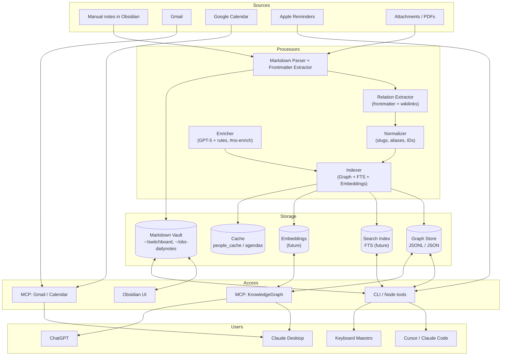

# Knowledge Graph Roadmap (obs-dailynotes / switchboard)

This roadmap defines a typed personal knowledge graph over `~/switchboard` and `~/obs-dailynotes` that tools, people, and LLMs can follow and contribute to. The initial implementation uses a JSON graph store (no SQLite) and is non-destructive to Markdown files.

## Architecture (high-level)



## Object model (frontmatter)

Use consistent `type`, `id`, `slug`, `aliases`, `links`, `tags`. IDs are stable and recorded in `config/slugToId.json`. Bodies stay human-friendly; relations live in frontmatter.

```yaml
type: person | organization | idea | paper | note
id: <type>:<slug>
slug: <kebab-case>
aliases: []
links: {}
topics: []
relations: {}
```

Type-specific fields:
- person: `emails[]`, `orgs[]`, `sensitivity`
- organization: `people[]`, `parents[]`, `children[]`
- idea: `related[]`, `status`
- paper: `authors[]`, `year`, `doi`, `venue`, `file`
- note: `related[]`

## JSON graph store

- Location: `data/graph.jsonl` (append-only upserts) and `data/graph_meta.json` for indexes.
- Nodes: `{ id, type, slug, title, path, aliases[], topics[], updated_at }`
- Edges: `{ src_id, dst_id, rel_type, confidence, source }`
- Indexing is derived from Markdown; no file edits in Phase 1.

## MCP endpoints (initial)

- `kg_list_nodes({type?, query?})`
- `kg_get_node({id})`
- `kg_search({text})` (simple text filter for now)
- `kg_add_relation({src_id, dst_id, rel_type, note?})` (writes to JSONL)

## Migration status

- [x] Approve plan: typed graph, JSON store, diagram with Users
- [x] Add `graph:index` script and scaffolding
- [x] Phase 1: Initial non-destructive index over `~/switchboard` and `~/obs-dailynotes`
- [x] Phase 1: Generate `data/graph.jsonl` and `data/graph_meta.json`
- [ ] Phase 2: Frontmatter harmonization (ids/slugs) – proposal draft
- [x] Phase 3: MCP server (`tools/mcpServers/knowledgeGraph.js`) – JSON-backed
- [ ] Phase 4: Obsidian Dataview dashboard templates
- [ ] Phase 5: LLM enrichment uses graph context, respects `#no-enrich`

## How to contribute (people, LLMs, tools)

Follow this contract:

1) Frontmatter contract
- Keep a `type` and `slug` in relevant files; if missing, propose values but do not edit without approval.
- Do not rewrite note bodies; add relations only in frontmatter proposals.

2) Graph contract
- Write new edges via `tools/knowledgeGraph/indexer.js --add-edge` or MCP method.
- Do not delete nodes; mark superseded via a `rel_type: supersedes` edge.

3) Formatting contract
- Preserve a single blank line between sections in Markdown.
- Respect `#no-enrich` and source-only usernames.

## Next actions

- Run: `npm run graph:index` to refresh the JSON graph.
- Start MCP server: `npm run mcp:kg` (tools available: list_nodes, get_node, search, add_relation).
- Review `data/graph_report.md` for counts and missing metadata.

*Last updated: 2025-08-12*