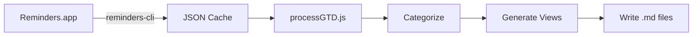

# GTD Implementation Details

## Architecture Overview

```
┌─────────────────┐     ┌──────────────────┐     ┌─────────────────┐
│ Apple Reminders │────▶│  obs-dailynotes  │────▶│ Obsidian Vault  │
│   (Data Store)  │◀────│   (Processing)   │◀────│   (Interface)   │
└─────────────────┘     └──────────────────┘     └─────────────────┘
        │                        │                         │
        ▼                        ▼                         ▼
   Native Apps              Node.js/CLI              Markdown Files
```

## Core Components

### 1. Data Layer (Apple Reminders)

**Technology**: macOS Reminders.app + reminders-cli
**Location**: System application
**Purpose**: Canonical data store for all tasks

**Key Features**:
- Native sync across Apple devices
- Siri integration
- System notifications
- Shared lists with others

### 2. Processing Layer (obs-dailynotes)

**Technology**: Node.js application
**Location**: `/Users/joi/obs-dailynotes/`
**Purpose**: Bridge between Reminders and Obsidian

**Key Modules**:

```javascript
// tools/processGTD.js - Main GTD processor
- parseGTDElements()     // Extract tags and metadata
- categorizeReminders()  // Sort into GTD buckets
- linkPeopleInTitle()    // Add [[wikilinks]] to names
- formatTask()           // Convert to markdown

// lib/services/gtdService.js - Core service layer
- morning workflow       // Generate views
- sync workflow         // Two-way sync
- validation logic      // Data integrity

// lib/pipelines/gtdMorning.js - Morning pipeline
- Pull fresh data
- Process GTD tags
- Generate all views
- Update daily note

// lib/pipelines/gtdSync.js - Sync pipeline
- Detect completions
- Update Reminders
- Refresh views
- Handle conflicts
```

### 3. Presentation Layer (Obsidian)

**Technology**: Markdown files with metadata
**Location**: `/Users/joi/switchboard/GTD/`
**Purpose**: Human-friendly task views

**Generated Files**:
- `dashboard.md` - Main GTD overview
- `next-actions.md` - All next actions
- `email-tasks.md` - Email-specific tasks
- `waiting-for.md` - Delegation tracking
- `scheduled.md` - Time-based view

## Data Flow

### Morning Routine (Read Path)



1. **Extract**: `reminders show --format json` → cache
2. **Transform**: Parse tags, priorities, dates
3. **Load**: Read people index, apply linking
4. **Generate**: Create markdown views
5. **Write**: Save to GTD folder

### Sync Process (Write Path)


1. **Scan**: Find tasks with `<!--reminders-id:xxx-->`
2. **Compare**: Check completion status
3. **Update**: Mark complete in Reminders
4. **Refresh**: Regenerate views

## Task Identification

Each task maintains identity through:

```markdown
- [ ] Task title <!--reminders-id:x-apple-reminderkit://REMCDReminder/123-->
```

**Components**:
- Checkbox state: `[ ]` or `[x]`
- Human-readable title with [[links]]
- Hidden comment with unique ID
- List source in parentheses

## Tag Processing Pipeline

```javascript
// Input
"Email Sarah about budget #email !! tomorrow"

// Step 1: Extract priority
priority: "urgent" (from !!)
cleanTitle: "Email Sarah about budget #email tomorrow"

// Step 2: Extract tags
tags: ["email"]
cleanTitle: "Email Sarah about budget tomorrow"

// Step 3: Parse date
dueDate: "2025-08-17T00:00:00.000Z"
cleanTitle: "Email Sarah about budget"

// Step 4: Link people
linkedTitle: "Email [[Sarah Chen]] about budget"

// Output
{
  title: "Email [[Sarah Chen]] about budget",
  priority: "urgent",
  tags: ["email"],
  dueDate: "2025-08-17T00:00:00.000Z",
  id: "x-apple-reminderkit://REMCDReminder/123"
}
```

## People Linking Algorithm

```javascript
// People index structure
{
  "Sarah Chen": {
    "aliases": ["Sarah", "S. Chen", "Chen"],
    "email": "sarah@example.com",
    "remindersListName": "Sarah Chen"
  }
}

// Linking process
1. Load people.index.json
2. Sort aliases by length (longest first)
3. For each alias:
   - Skip if ambiguous (multiple people)
   - Replace with [[canonical name]]
4. Preserve existing [[links]]
```

## Configuration Management

### Environment Variables (.env)

```bash
# Paths
DAILY_NOTE_PATH=/Users/joi/switchboard/dailynote
VAULT_ROOT=/Users/joi/switchboard

# Sync behavior
SYNC_MINIMAL_SOURCES=true      # Only today's note
SYNC_CREATE_NEW=false          # Don't create from markdown
SYNC_EDIT_EXISTING=false       # Don't edit from markdown
ENABLE_AGENDAS=false           # Don't inject agendas

# Processing
GTD_DEFAULT_LIST=Reminders     # Default capture list
PEOPLE_INDEX_PATH=people.index.json
```

### Stability Mode vs Full Sync

**Stability Mode** (Default):
- ✅ Mark tasks complete
- ✅ Pull fresh data
- ❌ Create new tasks
- ❌ Edit task text
- ❌ Delete tasks

**Full Sync** (Opt-in):
```javascript
SYNC_CREATE_NEW=true
SYNC_EDIT_EXISTING=true
```

## Error Handling

### Graceful Degradation

1. **Missing Cache**: Auto-run `reminders:pull`
2. **No People Index**: Skip people linking
3. **Invalid Tags**: Default to inbox
4. **Sync Conflicts**: Preserve both versions
5. **API Failures**: Use cached data

### Logging Strategy

```javascript
console.log('🚀 Starting...')     // Process start
console.log('  ✓ Complete')       // Success
console.warn('  ⚠ Warning')       // Non-fatal issue
console.error('❌ Error')          // Fatal error
```

## Performance Optimizations

### Caching Strategy

- **Reminders Cache**: 5-minute TTL
- **People Index**: Rebuilt on demand
- **GTD Views**: Regenerated each run
- **Daily Notes**: Incremental updates

### Batch Operations

```javascript
// Good: Single reminders call
reminders show --format json --list "all"

// Bad: Multiple calls
reminders show --list "Reminders"
reminders show --list "Work"
reminders show --list "Personal"
```

## Testing Approach

### Unit Tests
```javascript
// tests/unit/test_gtd_processing.py
- Tag extraction
- Date parsing
- People linking
- Priority detection
```

### Integration Tests
```bash
# Manual test sequence
npm run gtd:morning      # Should generate views
npm run gtd:sync        # Should sync completions
npm run reminders:pull  # Should update cache
```

## Security Considerations

1. **No Credentials**: Uses system reminders-cli
2. **Local Only**: No network calls
3. **Read-Heavy**: Minimal write operations
4. **ID Preservation**: Never loses task identity
5. **Backup Friendly**: Plain text markdown

## Extension Points

### Adding New Tags

```javascript
// In processGTD.js
const GTD_TAGS = {
  // Add new tag
  research: '#research'
};

// Add to categorization
if (elements.tags.includes('research')) {
  categories.research.push(task);
}
```

### Custom Views

```javascript
// Create new generator function
function generateCustomView(categories) {
  return `# Custom View\n${formatTasks(categories.custom)}`;
}

// Add to main()
fs.writeFileSync('custom.md', generateCustomView(categories));
```

---

*For operational usage, see [Operations Guide](operations.md)*
